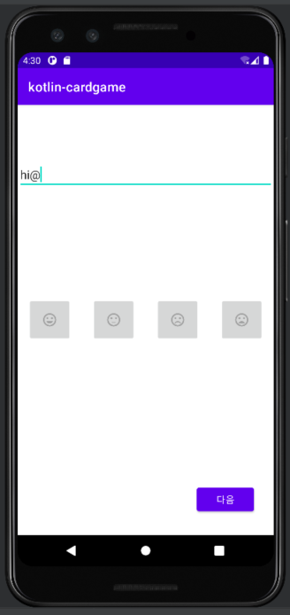

# Step1

- 요구사항 파악
- 구현 완료 후 자신의 github 아이디에 해당하는 브랜치에 PR을 통해 코드 리뷰 요청
- 코드 리뷰 피드백에 대한 개선 작업 후 push
- 모든 피드백 완료 후 다음 단계를 도전하고 이전 과정 반복





---
<br></br>

## Step 4

### 카드 및 덱 클래스 설계 방식

- 클래스들끼리 의존하는 부분에 있어서 콘크리트 클래스가 아닌 인터페이스를 의존할 수 있도록 설계했습니다.
- IDeck 과 ICard 인터페이스들은 각각 덱과 카드를 추상화했습니다.
- FruitDeck 과 FruitCard 는 각각의 인터페이스를 구현했고 FruitDeck 은 FruitCard에 의존하고 있습니다.
- FruitCard 의 과일은 유니코드 보다 enum 으로 관리하는 것이 이해하기 쉽다고 판단하여 Enum으로 제작

### 게임 및 유저 클래스 설계 방식

- Game 클래스는 User 클래스를 의존합니다. 이때 User 클래스의 변화 혹은 확장 가능성이 적다고 판단하여 콘크리트 클래스로 의존
- Game 과 User 는 각각 IDeck 과 ICard 에 의존하여 확장에 열린 상태로 설계함
- GameMode 는 한자리 수 숫자이고 int 값 이 그 의미를 더 잘 전달한다고 판단하여 enum 클래스 제작 X

# 추가 학습내용

<br></br>

## ConstraintLayout

- RelativeLayout 의 상대적 위치 관계에 따른 배치 기능
- LinearLayout 의 가중치 기능
- Chain 을 사용해 다른 레이아웃 없이 요소드를 그룹화 가능

### Chain

: 위젯들 끼리 제약 조건으로 묶임

1. Spread
    - 양 옆 마진을 계산하고 위젯들끼리 남은 공간을 균등히 할당 받음
2. Spread Inside
    - 양 옆 마진 없이 위젯들끼리 공간을 균등히 할당 받음
    - 마진값 보다 우선시 됨
3. Weighted
    - spread or spredInside 설정후 맞추고 싶은 높이 혹은 너비를 0dp 설정
    - weight 를 통해서 체우기
4. Packed
    - 연결 된 위젯들끼리 붙게됨
    - 마진으로 조절
    - 가운데로 붙지 않고 치우쳐서 붙을 수 있음(layout_constraintHorizontal_bias = 0 일시 왼쪽 정렬)


1. 문제상황 View 의 크기를 구해서 특정 작업을 진행하려는데 계속 view의 크기가 0 이라는 답을 얻었다. 문제를 확인해보니 View가 그려지기 전에 그 크기에 접근했기
   때문이라고 한다. 실제로 View 는 onResume 에서 그려지기 때문에 이를 위해서 ViewTreeObserver 를 사용했다.

<br></br>

## 2. ViewTreeObserver

### 문제 상황

View 의 크기를 구해서 특정 작업을 진행하려는데 계속 view의 크기가 0 이라는 답을 얻었다. 문제를 확인해보니 View가 그려지기 전에 그 크기에 접근했기 때문이라고 한다.
실제로 View 는 onResume 에서 그려지기 때문에 이를 위해서 ViewTreeObserver 를 사용했다.

### ViewTreeObserver 요약

이름 그대로 ViewTree에 대한 옵저버 역할을 하며 옵저버의 리스너를 등록하면 ViewTree 의 변화를 감지할 수 있다. 리스너로는 아래와 같은 리스너를 선택하여 변화를 감지
할 수 있다.

ViewTreeObserver.XX 의 리스너를 생성하고 등록한뒤에는 반드시 remove 해주는 것 이 필요하다. 제거해주시 않으면 어떤 리스너를 생성하던 끊임 없이 호출되어
메모리를 낭비할 수 있다. 그리고 이때 OnDrawListener 를 채택하여 사용하였는데 draw 리스너는 리스너의 삭제를 오버라이딩 한 공간에서 할 수 없는지라 대체로
OnGlobalLayoutListener 를 선택 해서 사용했다. 이에 대한 정확한 이유는 찾지 못했다.....

## 3. View 의 생명주기

- View 에도 아래 그림과 같은 생명주기가 존재함
- 차례대로 호출되면서 기능을 수 행함

### invalidate() vs requestLayout()

그림과 같이 돌아가는 위치가 다르다. 특히 view 의 크기를 재설정하고 싶은 상황이라면 onMeasure()를 호출하는 requestLayout() 을 사용해야한다.


<br></br>

## 4. Task 와 Stack(BackStack)

### Task

- Task 는 Activity 의 stack 이다.
- 앱이 실행되고 Activity 가 생성되고 이동할때 마다 객체는 Task 안에 backStack 에 쌓이게 된다.
- 포그라운드 앱의 Task 에서 stack 최상단에 있는 Activity 가 사용자에게 보여진다.
- back 버튼이나 종료를 통해 stack 에서 pop 할 수 있다.

### 동일한 Activity 에 대한 처리

- Activity 는 호출 될때마다 기본적으로 새로운 객체를 생성함
- 동일한 Activity에 대해 전에 있던 객체를 사용하기 위해서는 추가적 장치가 필요함
    1. launchMode : Manifest 에 Activity 별로 등록
    2. Flag : Intent에 추가해서 넘기기 - 일회성

### launchMode

- manifest 파일에 아래와 같이 입려하여 사용한다.
- 일회성이 아닌 Activity 에 대해서 항상 해당 모드를 적용한다.

1. standard
    - 액티비티를 호출 할 때마다 인스턴스 생성

2. singleTop
    - 액티비티가 Task 맨 위에 존재하는 경우 새로운 인스턴스 호출 대신 기존의 인스턴스를 불러온다(정확히는 해당 인스턴스로 경로를 설정한다.)
    - ex ) 검색화면에서 검색하여 현재 Activity를 또 호출할때 -> singleTop 안하면 같은 화면 두번 back 해야 함
3. singleTask
    - 기존에 존재하던 인스턴스사용 없다면 생성
4.

#### Task Affinity

- Task 내에서 Activity 들 끼리 묶을 수 있는 요소이다.
- affinity 를 추가해주지 않으면 모든 Acitivity 가 같은 affinity 를 같는 효과를 보인다.

```
<activity
android:taskAffinity="com.gootle.android.youtube"/>
```

## 5. Fragment

### Fragment 생명주기

- Activity와 비슷 한 생명주기를 가짐
- onCreate 가 아닌 onCreateView 가 Activity 에 onCreate 에 대응함
    - 레이아웃을 인플레이트 함
    - View 객체들을 초기화 할 수 있음
    - 매개변수인 container : ViewGroup 가 Fragment Activity 위 에 담길 곳임
- Activity 와 다르게 addToBackStack() 함수를 명시적으로 호출 하지 않으면 backStack 에 담기지 않음

### Fragment vs Activity

- Fragment를 통해 좀더 유연한 UI 를 구성할 수 있다.
    - 한 화면을 부분 부분으로 나누어 사용할 수 있음
    - 엑티비티 일부 와 Fragment들로의 구성

- 재사용성의 증가
    - Fragment를 통해 조립식 화면 구성을 할 수 있다.
    - DialogFragment 와 같은 경우는 FragmentManager 만 있으면 어떤 엑티비티나 Fragment 에서도 활용 가능하다

- 퍼포먼스
    - 액티비티보다 Fragment 가 더 가볍다
    - 액티비티 스택에 쌓아놓는 것보다 Fragment backStack 으로의 관리가 메모리 효율적이다.
    - 액티비티 스택은 앱수준에서 기록을 볼 수 가 없었음

- 통신
    - 액티비티 간 데이터를 공유는 Intent를 사용한다.
    - Activity는 다른 Process에서 실행하는 것을 염두하고 설계 되었기에 메모리 영역을 공유하지 않는다.
    - intent 는 IPC 통신을 통해서 전달되며 이는 매우 무겁다.
    - 액티비티 간, 데이터를 전달하려면 직렬화/역직렬화 과정을 거쳐야 하고 이는 메모리 공유에 비해 절대 가벼운 작업은 아니다.
    - 반면 액티비티를 공유하는 Fragment 끼리는 View Model 공유를 통해 쉽게 통신 가능

- 총론
    - Fragment 는 독립적으로 존재할 수 없으므로 Activity 를 아에 없앨 수 는 없다.
    - FragmentManager Transaction 은 비동기 작업으로 예기치 못한 오류를 발생시키기도한다.
    - Fragment 의 다양한 장점을 고려했을때 Activity 보다는 Fragment 위주의 Ui 구성이 좋겠다.


